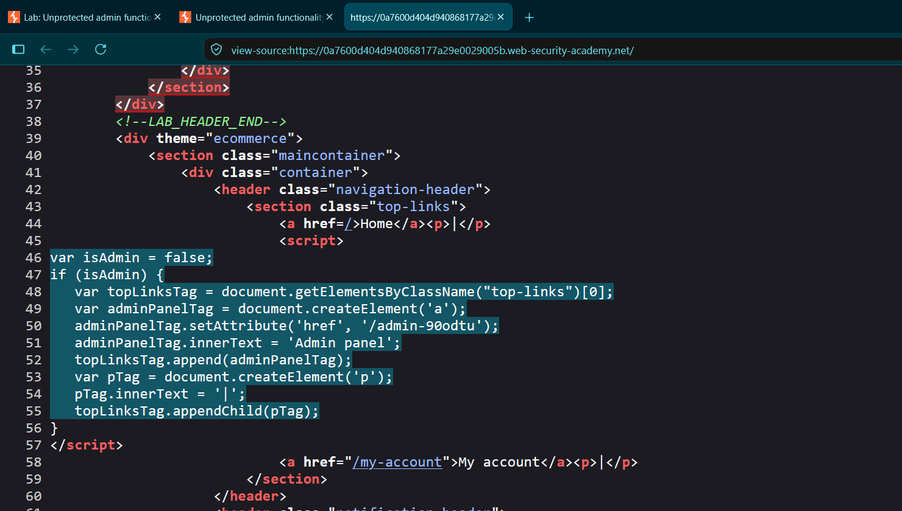
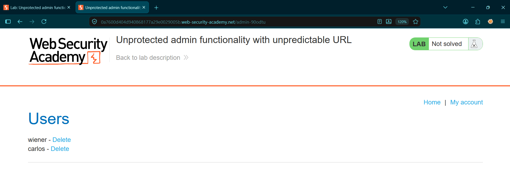
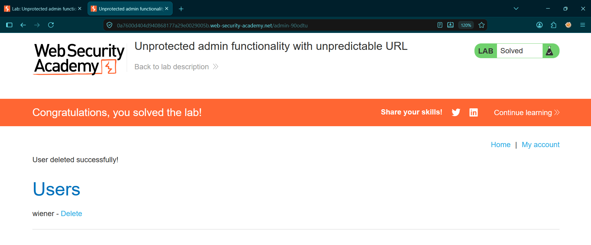

# Unprotected Admin Functionality with Unpredictable URL

* **Platform:** PortSwigger Web Security Academy
* **Vulnerability Class:** Broken Access Control & Information Exposure (CWE-306, CWE-200)
* **Severity:** High (CVSS: 7.5)

---

## 1. Executive Summary
The target application utilizes an obfuscated URL to hide its administrative dashboard. However, the application leaks this sensitive URL directly within the front-end HTML source code (Information Exposure). An unauthenticated attacker can view the page source, extract the hidden path, and navigate to the dashboard to execute arbitrary administrative actions, such as deleting user accounts (Broken Access Control).

## 2. Reproduction Steps
1. Navigate to the target application's homepage.
2. Right-click and select "View Page Source".
3. Review the inline JavaScript executing on the page.
4. Locate the script block handling the `isAdmin` variable, which explicitly discloses the administrative path: `adminPanelTag.setAttribute('href', '/admin-90odtu');`.
5. Append `/admin-90odtu` to the application's base URL and press Enter.
6. The administrative dashboard loads successfully without prompting for authentication.
7. Click the "Delete" link next to the user `carlos` to escalate privileges and solve the lab.

## 3. Proof of Concept (PoC)

**Reconnaissance (Information Exposure):**
Reviewing the client-side source code reveals the obfuscated administrative endpoint.

**Privilege Bypass (Missing Authentication):**
Navigating to the extracted path grants full administrative access without session validation.

**Exploitation (Impact):**
Executing the delete action on the target user `carlos`.

---

## 4. Remediation
* **Enforce Authentication:** Implement strict server-side session validation on all administrative routes. The server must verify that the requesting user has an active, authenticated `admin` role before rendering the interface or processing actions. 
* **Remove Sensitive Front-End Logic:** Never trust the client. Do not rely on URL obfuscation for security, and do not ship privileged routing logic or hidden endpoints in client-side JavaScript or HTML comments.
