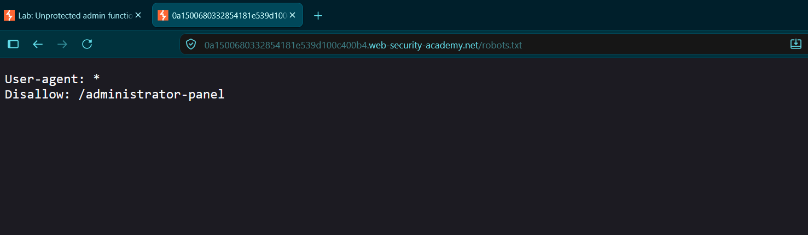

# Unprotected Admin Functionality

**Platform:** PortSwigger Web Security Academy

**Vulnerability Class:** Broken Access Control / Missing Authentication (CWE-306)

**Severity:** High (CVSS: 7.5)

---

## 1. Executive Summary
The target application contains an unprotected administrative dashboard. The hidden path to this panel is leaked via the public `robots.txt` file, allowing an unauthenticated attacker to discover the URL, bypass intended access controls, and execute arbitrary administrative actions (such as deleting user accounts). 

## 2. Reproduction Steps
1. Navigate to the target application and append `/robots.txt` to the URL.
2. Observe the crawler directives disclosing the hidden path: `Disallow: /administrator-panel`.
3. In the URL bar, replace `/robots.txt` with `/administrator-panel` and press Enter.
4. The administrative dashboard loads successfully without prompting for authentication.
5. Click the "Delete" link next to the user `carlos` to execute the privilege escalation.

## 3. Proof of Concept (PoC)

**Reconnaissance:**
Accessing `robots.txt` reveals the administrative endpoint.

**Privilege Bypass:**
Directly navigating to the disclosed path grants full administrative access.

**Exploitation:**
Executing the delete action on the target user `carlos`.

---

## 4. Remediation
* **Enforce Authentication:** Implement strict server-side session validation on the `/administrator-panel` route. The server must verify that the requesting user has an active, authenticated `admin` role before rendering the interface or processing state-changing actions.
* **Remove from `robots.txt`:** Do not rely on "security through obscurity." Remove sensitive backend paths from public crawler instructions to prevent easy directory enumeration.
