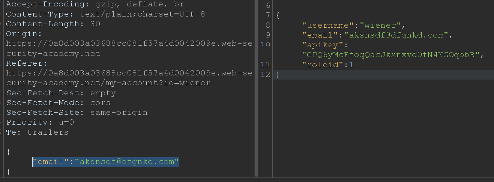
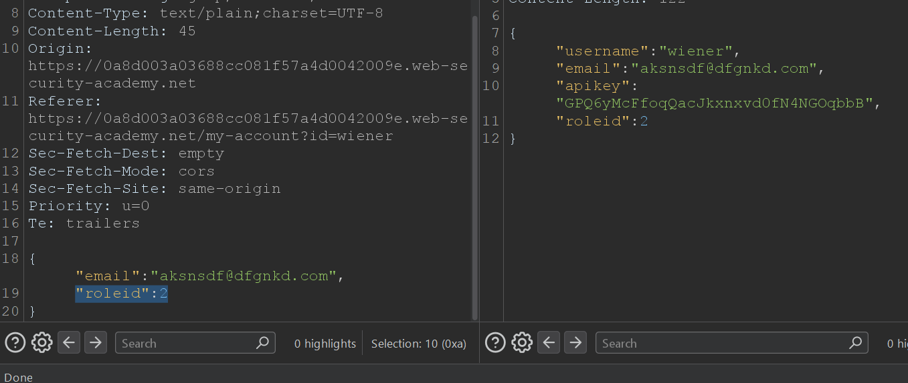

# User role can be modified in user profile

* **Platform:** PortSwigger Web Security Academy
* **Vulnerability Class:** Broken Access Control & Mass Assignment (CWE-284, CWE-915)
* **Severity:** High (CVSS: 8.5)

---

## 1. Executive Summary
The target application's user profile update functionality blindly binds incoming JSON request parameters directly to the server-side user data model (Mass Assignment). Because the endpoint lacks parameter whitelisting and privilege boundaries, an authenticated low-privilege user can inject an unauthorized `roleid` parameter into the update request, permanently elevating their account privileges to administrator (`roleid: 2`).

## 2. Reproduction Steps
1. Authenticate to the application using standard user credentials (`wiener:peter`).
2. Navigate to the `/my-account` page and submit an email change request.
3. Intercept the `POST` request using Burp Suite.
4. Forward the email update request to Burp Suite Repeater and dispatch it to observe that the server returns a JSON response disclosing the user's internal attributes, including `"roleid": 1`.
5. In the JSON request body, append the privilege parameter: `{"email":"<EMAIL>", "roleid":2}`.
6. Dispatch the modified request. The server accepts the parameter and returns `"roleid": 2` in the JSON response body.
7. Return to the browser session and refresh `/my-account` to confirm administrative access is now active.
8. Navigate to `/admin` and execute the deletion of user `carlos` to complete the exploitation.

## 3. Proof of Concept (PoC)

**Attribute Disclosure (Baseline Response):**
The initial profile update API response reveals the internal role attribute schema (`"roleid": 1`).

**Mass Assignment Privilege Escalation (Burp Repeater):**
Injecting `"roleid": 2` into the JSON payload updates the user's role on the backend.

**Privilege Verification (Admin Panel Access):**
Refreshing the user session reflects the updated permissions and exposes the `/admin` interface.

**Exploitation (Impact):**
Executing the unauthorized administrative user deletion on `carlos`.

---

## 4. Remediation
* **Implement Strict Parameter Whitelisting (DTOs):** Enforce strict input filtering on the backend by using Data Transfer Objects (DTOs). The profile update endpoint must only parse and bind explicitly permitted fields (such as `email`) and discard any unwhitelisted properties like `roleid` or `apikey`.
* **Segregate Role Management Endpoints:** Role assignment must be completely decoupled from user profile functions and restricted to dedicated administrative routes protected by robust authorization checks.
