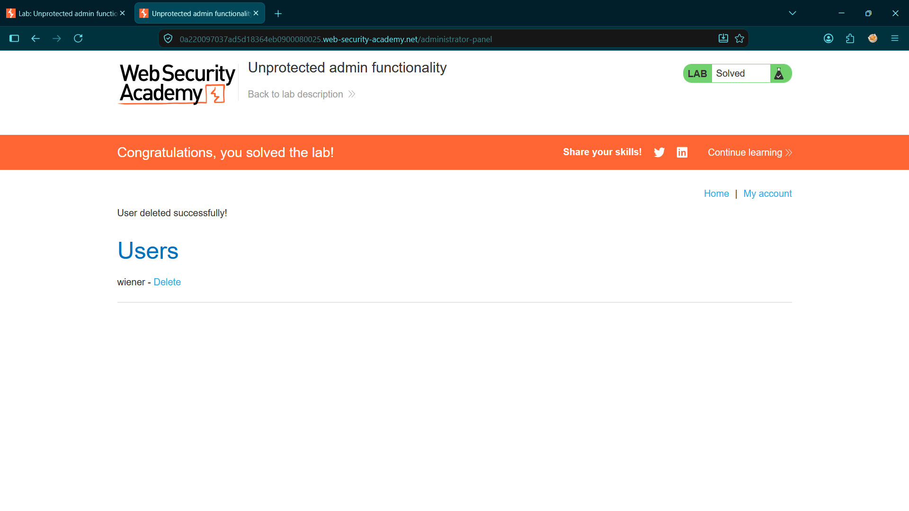

# Privilege Escalation via Insecure Cookie Manipulation

* **Platform:** PortSwigger Web Security Academy
* **Vulnerability Class:** Broken Access Control & Insecure Cookie Handling (CWE-284, CWE-565)
* **Severity:** High (CVSS: 8.0)

---

## 1. Executive Summary
The target application utilizes a predictable, unverified client-side cookie (`Admin=false`) to determine user authorization levels. Because the application fails to enforce cryptographic integrity or server-side validation on this cookie, an authenticated standard user can manually tamper with the cookie's value to escalate their privileges, granting them full unauthorized access to the administrative dashboard.

## 2. Reproduction Steps
1. Authenticate to the application using standard user credentials (`wiener:peter`).
2. Intercept the HTTP traffic using Burp Suite Proxy.
3. Observe that upon successful login, the server sets a predictable role-based cookie: `Set-Cookie: Admin=false`.
4. Send a subsequent `GET` request to the application (e.g., `/my-account` or `/admin`) to Burp Suite Repeater.
5. Manually modify the request header to forge the cookie value: `Cookie: session=<SESSION_ID>; Admin=true`.
6. Forward the tampered request. The server accepts the forged cookie and grants administrative privileges.
7. Navigate to the `/admin` endpoint using the forged cookie and execute the deletion of the user `carlos`.

## 3. Proof of Concept (PoC)

**Cookie Manipulation (Burp Suite):**
Intercepting and modifying the `Admin` cookie value to `true` within Burp Suite Repeater bypasses authorization checks.

**Privilege Escalation:**
Accessing the administrative dashboard via the forged authorization cookie.

**Exploitation (Impact):**
Executing the delete action on the target user `carlos` as an unauthorized user.

---

## 4. Remediation
* **Implement Server-Side State Management:** Never rely on arbitrary, client-controlled parameters (such as plaintext cookies, hidden form fields, or headers) to determine user roles or access levels. 
* **Enforce Role-Based Access Control (RBAC):** Store the user's role securely in a backend database or within a cryptographically signed/encrypted token (such as a JWT). The server must query this trusted backend state to verify privileges on every request to sensitive endpoints like `/admin`.
