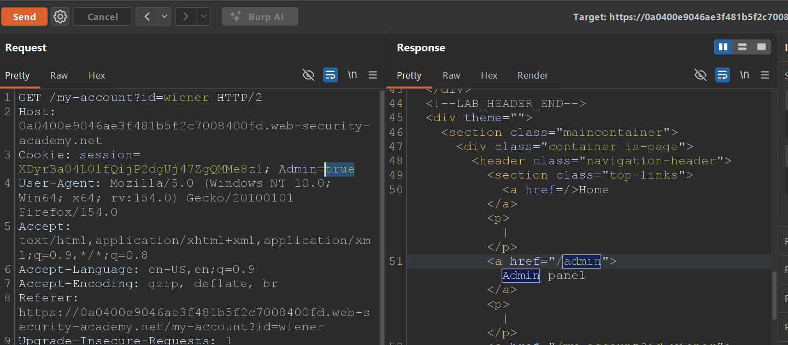
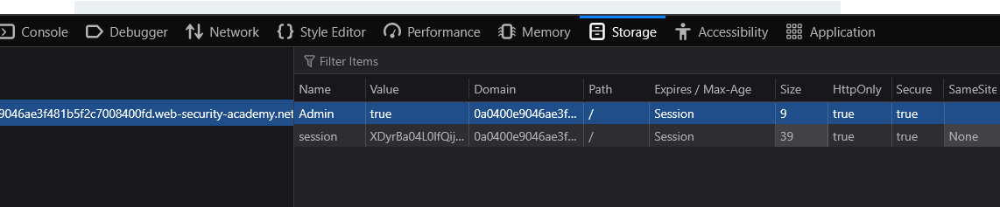
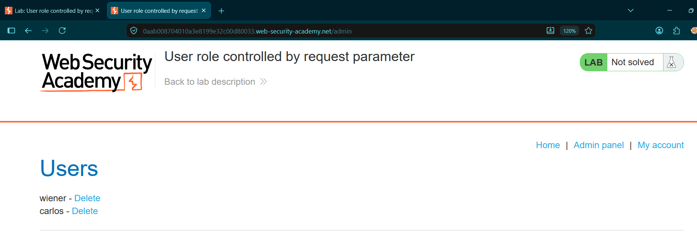
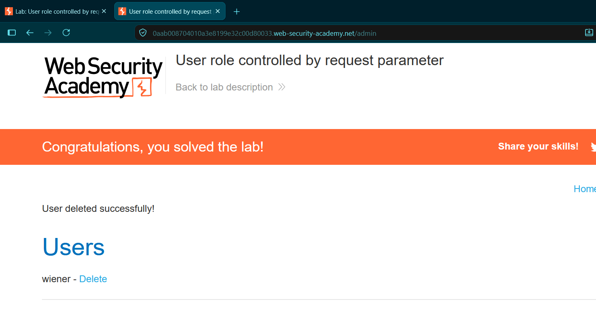

# User role controlled by request parameter

* **Platform:** PortSwigger Web Security Academy
* **Vulnerability Class:** Broken Access Control & Insecure Cookie Handling (CWE-284, CWE-565)
* **Severity:** High (CVSS: 8.0)

---

## 1. Executive Summary
The target application utilizes a predictable, unverified client-side cookie (`Admin=false`) to determine user authorization levels. Because the application fails to enforce cryptographic integrity or server-side validation on this cookie, an authenticated standard user can manually tamper with the cookie's value to escalate their privileges, granting them full unauthorized access to the administrative dashboard.

## 2. Reproduction Steps
1. Navigate to the `/admin` endpoint and observe that access is denied.
2. Authenticate to the application using standard user credentials (`wiener:peter`).
3. Intercept the login response using Burp Suite Proxy and observe the server setting a predictable role-based cookie: `Set-Cookie: Admin=false`.
4. **Validation Phase:** Send a subsequent `GET` request to Burp Suite Repeater. Manually modify the request header to `Cookie: Admin=true` and forward it to verify the server accepts the forged role.
5. **Exploitation Phase:** In the active browser session, open the browser's Developer Tools and navigate to the **Storage** tab.
6. Locate the `Admin` cookie and manually edit its value from `false` to `true`.
7. Navigate directly to `/admin` in the browser. The forged cookie grants access to the administrative dashboard.
8. Click the "Delete" link next to the user `carlos` to complete the attack.

## 3. Proof of Concept (PoC)

**Vulnerability Validation (Burp Repeater):**
Testing the cookie manipulation in Repeater confirms the server accepts the `Admin=true` payload and returns the privileged interface.

**Live Session Manipulation (Developer Tools):**
Modifying the active session's role parameter directly within the browser's Storage tab.

**Privilege Bypass:**
Accessing the administrative dashboard via the forged authorization cookie.

**Exploitation (Impact):**
Executing the delete action on the target user `carlos` as an unauthorized user.

---

## 4. Remediation
* **Implement Server-Side State Management:** Never rely on arbitrary, client-controlled parameters (such as plaintext cookies, hidden form fields, or headers) to determine user roles or access levels. 
* **Enforce Role-Based Access Control (RBAC):** Store the user's role securely in a backend database or within a cryptographically signed/encrypted token (such as a JWT). The server must query this trusted backend state to verify privileges on every request to sensitive endpoints like `/admin`.
